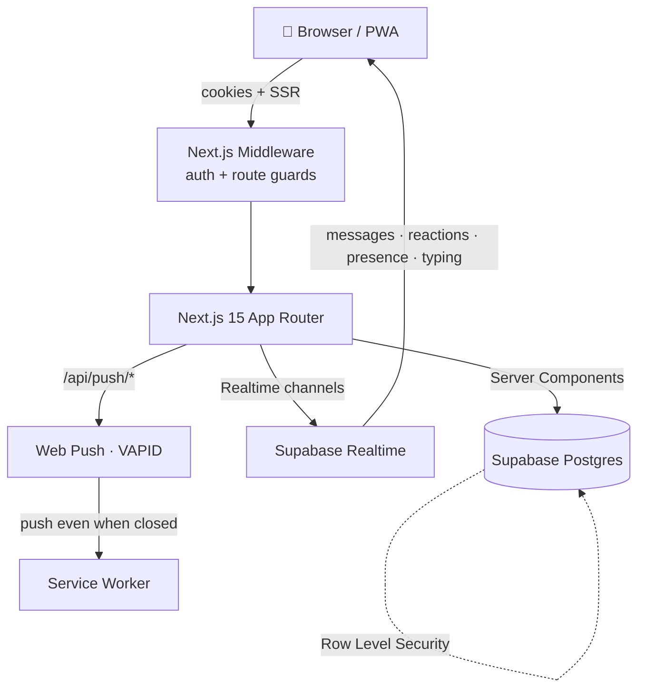

<div align="center">

# 🎓 Campus Buddy

### The real-time campus super-app for **MIT Academy of Engineering**
_WhatsApp-grade chat · Discord-style channels · Slack-level admin — built for one college, done right._

[](https://nextjs.org/)
[](https://www.typescriptlang.org/)
[](https://tailwindcss.com/)
[](https://supabase.com/)
[](#-progressive-web-app)

**[Features](#-what-makes-it-cool) · [Quick Start](#-quick-start) · [Security Model](#-security-that-actually-holds) · [Architecture](#-architecture) · [Shortcuts](#-keyboard--power-user) · [Test Accounts](#-test-accounts)**

</div>

---

## ⚡ Why Campus Buddy?

Scattered WhatsApp groups, lost PDFs, "which year's notice was that?" — Campus Buddy replaces all of it
with **one place** where students, CRs, professors, and admins meet in real time. Every student sees
exactly the channels for **their department and academic year** — no more, no less — and that boundary is
enforced **in the database**, not just hidden in the UI.

> **The one-line pitch:** a communication platform that _feels_ like WhatsApp, is _organized_ like Discord,
> and is _governed_ like Slack — scoped to a single campus and locked down at every layer.

---

## 🌟 What Makes It Cool

<table>
<tr><td width="50%" valign="top">

### 💬 Chat that feels alive
- **Live presence** — see who's online (`N online`)
- **Typing indicators** — "Aditi is typing…"
- **Multi-emoji reactions**, replies, edits, pins
- **Voice notes**, image/video/PDF/file sharing
- **@mentions** + `@everyone` with autocomplete
- **Polls** with live vote bars
- **Infinite scroll** history + jump-to-message
- **Starred messages** that sync across devices

</td><td width="50%" valign="top">

### 🛡️ Governed like a pro
- **DB-enforced** year/department isolation (RLS)
- **Announcement channels** — staff-only posting
- **Report & moderation** console for admins
- **Analytics dashboard** — activity, growth, top channels
- **Rate limiting** — anti-flood at the database
- **Upload guards** — size + MIME enforced
- **Global ⌘K search** across channels/messages/people
- **Web Push** — notified even when the app is closed

</td></tr>
</table>

### 📲 Everywhere, instantly
Installable **PWA** · mobile-first with true `100dvh` + safe-area handling · dark / light / charcoal themes ·
60fps micro-interactions · full keyboard navigation.

---

## 🧩 Feature Matrix

| Module | Highlights |
| :--- | :--- |
| **🔐 Auth & RBAC** | PRN-email login · 4 roles (**Student / CR / Professor / Admin**) · enforced frontend **+** middleware **+** backend **+** RLS |
| **💬 Channels** | Department + year scoped · announcement-only mode · private rooms · file/media/voice sharing |
| **⚡ Real-time** | Messages, reactions, polls, presence, typing, notifications — all live via Supabase Realtime |
| **🔎 Search** | Global **⌘K** command palette — channels, messages, and people (RLS-scoped, injection-safe) |
| **🔔 Notifications** | In-app center · browser notifications · **Web Push** (VAPID) for closed-app delivery |
| **🛠️ Admin** | Manage users/roles/years, channels, clubs, events · **moderation** queue · **analytics** dashboard |
| **📚 Academics** | Courses & modules · PYQs & Notes portals · learning-status tracking |
| **🎉 Events & Clubs** | Campus calendar with RSVP · club directory with galleries |
| **🎨 UX** | PWA install · dark/light/charcoal · Framer Motion · Material-3-inspired, glassy surfaces |

---

## 🔒 Security That Actually Holds

Campus Buddy's headline guarantee — _a student can only ever touch their own year & department_ — is
enforced at **every layer**, so bypassing the UI gets you nowhere:

| Layer | What it does |
| :--- | :--- |
| **Frontend** | Filters the sidebar/lists so users only _see_ what's theirs (`channelVisibility.ts`) |
| **Middleware** | Guards routes at the edge; redirects unauthenticated users, gates `/admin/*` |
| **Backend** | Services validate ownership + inputs before writing |
| **🧱 Row Level Security** | **The real boundary.** `can_access_channel()` / `can_post_channel()` mirror the app rules in Postgres — the API itself refuses cross-year/department reads and writes |

Plus: server-side **rate limiting** on message inserts (anti-flood), **storage guards** (avatars ≤ 2 MB image-only,
files ≤ 20 MB), **injection-safe** search, moderation with an audit trail, and a `SECURITY DEFINER` analytics
layer that leaks nothing to non-admins.

> 🧪 **Prove it yourself:** log in as a student and change the channel id in `/channels/<id>` to another
> year's channel — you'll get **not-found**, because the database says no.

---

## 🏗️ Architecture



```text
campus-buddy/
├── frontend/                     # ✨ Next.js 15 app (runs from repo root: `next dev frontend`)
│   ├── app/(dashboard)/          # 🔒 Protected pages — chat, admin, analytics, moderation
│   ├── app/api/push/             # 🔔 Web Push subscribe / unsubscribe / send
│   ├── components/               # 🧩 UI — channels/chat, layout, ui primitives
│   ├── hooks/                    # 🎣 useMessages, usePresence, useNotifications, …
│   ├── middleware.ts             # 🛡️ Edge auth + admin guards
│   └── manifest.ts               # 📲 PWA manifest
├── backend/                      # 🧠 Data + business logic
│   ├── lib/                      # supabase clients, chat utils, webpush
│   └── services/                 # channels · moderation · analytics · search · push
├── database/
│   └── schema.sql                # 🗄️ ONE authoritative, idempotent schema (RLS, RPCs, triggers)
└── scripts/                      # 🤖 seeding & admin utilities
```

**Stack:** Next.js 15 (App Router) · React 18 · TypeScript · Tailwind CSS · Framer Motion ·
Supabase (Postgres · Auth · Storage · Realtime) · `web-push` · deployed on Vercel.

---

## 🚀 Quick Start

### 1 — Clone & install
```bash
git clone <repo-url>
cd "Campus Buddy/Project Dir"
npm install          # if peer-deps complain: npm install --legacy-peer-deps
```

### 2 — Configure environment
```bash
cp frontend/.env.example frontend/.env.local
```
Fill in `frontend/.env.local` (see the [table below](#-environment-variables)).

### 3 — Set up the database  ⚠️ _one file, that's it_
Open **Supabase → SQL Editor** and run the entire **`database/schema.sql`**.
It's **idempotent** (safe to re-run) and creates every table, index, RLS policy, trigger, storage
bucket, and analytics function in one shot.

### 4 — (Optional) seed demo data
```bash
node scripts/seed_users.mjs           # roles + sample students
node scripts/seed_test_students.mjs   # dedicated FY / SY / TY set
npm run create-admin                  # promote an admin
```

### 5 — Run it
```bash
npm run dev      # → http://localhost:3000
```

---

## 🔑 Environment Variables

| Variable | Required | Purpose |
| :--- | :---: | :--- |
| `NEXT_PUBLIC_SUPABASE_URL` | ✅ | Supabase project URL |
| `NEXT_PUBLIC_SUPABASE_ANON_KEY` | ✅ | Public anon key (browser) |
| `SUPABASE_SERVICE_ROLE_KEY` | ✅ | Server-only key (push send, admin scripts) — **never expose** |
| `NEXT_PUBLIC_APP_URL` | ✅ | App base URL (e.g. `http://localhost:3000`) |
| `NEXT_PUBLIC_VAPID_PUBLIC_KEY` | ⭕ | Web Push public key (browser subscribes with it) |
| `VAPID_PRIVATE_KEY` | ⭕ | Web Push **secret** — signs pushes server-side |
| `VAPID_SUBJECT` | ⭕ | Contact `mailto:` or URL for the push service |

> ⭕ = optional. Skip the VAPID keys and everything works — push simply no-ops until they're set.
> Generate a pair with **`npx web-push generate-vapid-keys`**.

---

## ⌨️ Keyboard & Power-User

| Shortcut | Action |
| :--- | :--- |
| `⌘ K` / `Ctrl K` | Open **global search** (channels · messages · people) |
| `Enter` | Send message · `Shift+Enter` for a new line |
| `@` | Mention autocomplete (`@everyone` supported) |
| Right-click a message | Reply · React · Pin · Star · **Report** · Copy · Delete |
| Scroll up in a channel | **Load older** messages (infinite history) |
| Click a pin / reply preview | **Jump to** the original message |

---

## 📲 Progressive Web App

Campus Buddy is an installable PWA — **Add to Home Screen** on Android/iOS for a full-screen, app-like
experience. It ships a web manifest, a service worker for **Web Push**, `100dvh` + safe-area layouts for
notched phones, and 44px touch targets throughout.

---

## 🧑‍💻 Scripts

| Command | What it does |
| :--- | :--- |
| `npm run dev` | Start the dev server (`frontend`) |
| `npm run build` | Production build |
| `npm run start` | Serve the production build |
| `npm run create-admin` | Promote/create an admin user |
| `node scripts/seed_users.mjs` | Seed roles + sample students |
| `node scripts/seed_test_students.mjs` | Seed FY / SY / TY students |
| `node scripts/check_database.mjs` | Sanity-check the DB connection/tables |

---

## 🧪 Test Accounts

All accounts use the password **`password123`**.

| Role | Email |
| :--- | :--- |
| 👑 **Admin** | `300000000001@mitaoe.ac.in` |
| 👨‍🏫 **Professor** | `200000000001@mitaoe.ac.in` |
| 🗣️ **CR** | `100000000004@mitaoe.ac.in` |
| 🎓 **Student (Y2)** | `100000000001@mitaoe.ac.in` |
| 🎓 **Student (Y3)** | `100000000002@mitaoe.ac.in` |
| 🎓 **Student (Y1)** | `100000000003@mitaoe.ac.in` |
| 🎒 **FY / SY / TY** | `fy.student@` · `sy.student@` · `ty.student@test.mitaoe.ac.in` |

---

## 🚢 Deploy (Vercel)

1. Push to GitHub and import the repo into **Vercel**.
2. Add all [environment variables](#-environment-variables) in Vercel → Settings.
3. Run **`database/schema.sql`** once in your production Supabase project.
4. In Supabase **Auth → URL Configuration**, add your production domain.
5. **Deploy.** 🚀

> 💡 Use Supabase's **Supavisor pooled connection** (port `6543`) for serverless scale.

---

## 🗺️ Roadmap

**✅ Shipped:** DB-enforced RBAC · presence & typing · multi-emoji reactions · synced stars ·
global search · announcement channels · reporting & moderation · analytics dashboard ·
installable PWA · Web Push · message pagination · rate limiting · mobile/safe-area polish.

**🔜 Considered / deferred:**
- 🧵 Threaded replies _(inline quoted replies ship today; true threads are a deliberate next step)_
- 🤖 `@buddy` AI assistant trained on PYQs & Notes
- 📅 Calendar sync (Google / Apple) for events

_(Per-message read receipts were intentionally dropped — channel-level unread counts already cover it
without the write amplification at scale.)_

---

<div align="center">

**Built with ❤️ for MIT Academy of Engineering**

_Preserve what's good, harden what's weak, ship what students actually use._

</div>
